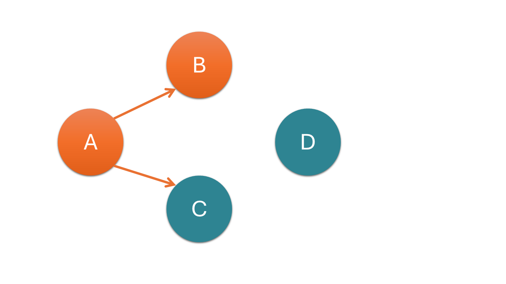
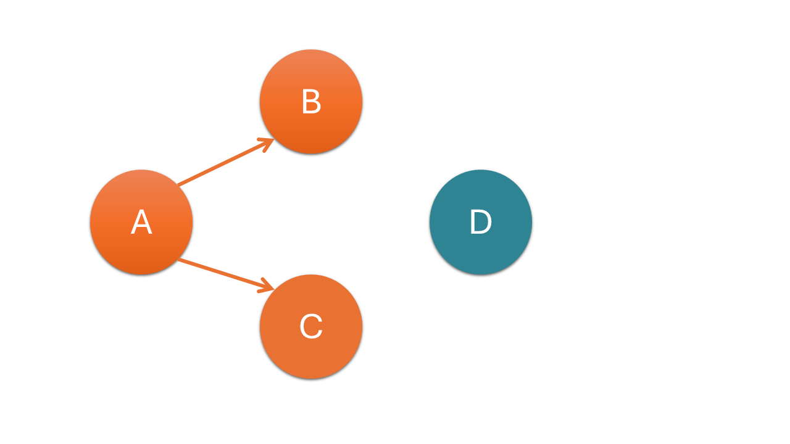
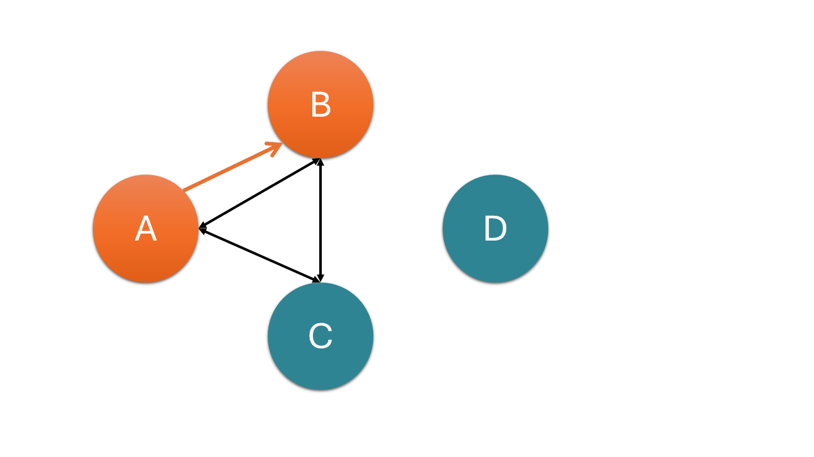
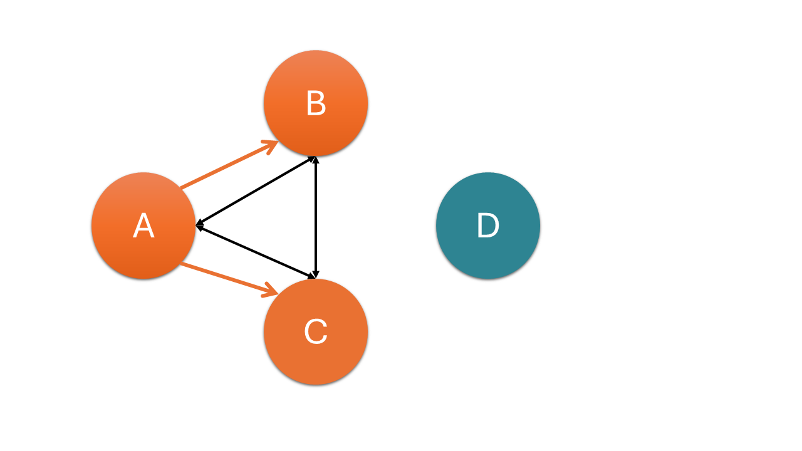
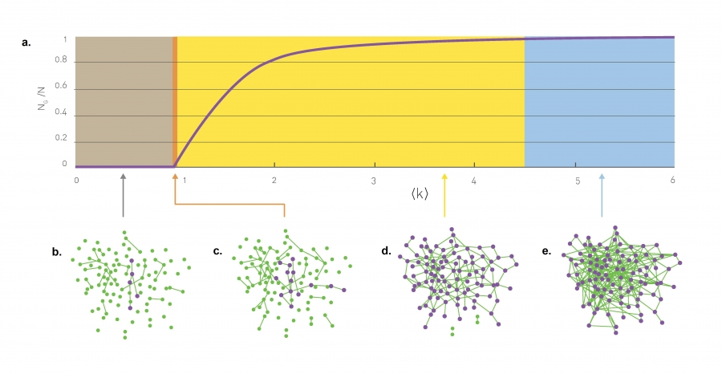
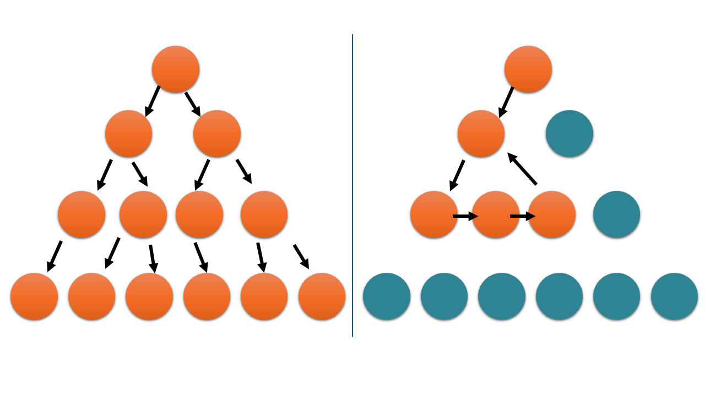
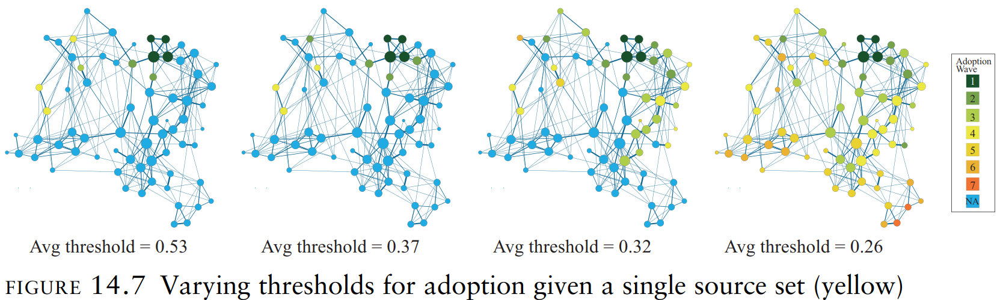
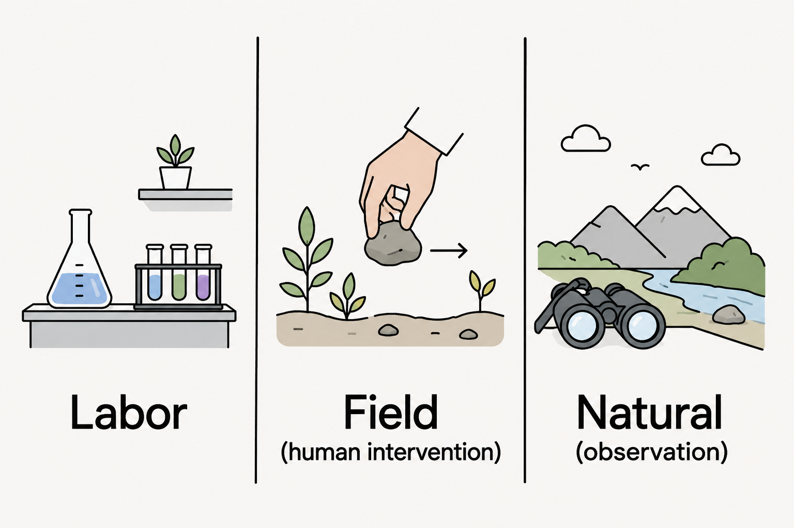

## Motivation {.custom-smaller}

## Agenda: Models for Network Diffusion {.custom-smaller}

1.  Flows

2.  SIR model

3.  Network topology effects

4.  Simulation Models

5.  Dynamic Networks

6.  Social and behavioral diffusion

7.  Treshold Models


## Agenda: Models for Social Influence {.custom-smaller}

1.  Network Theory

2.  Causal Inference

3.  Methodological Challenges

4.  Research Strategies

5.  Modeling effects of Network social influence (Instrumental Variable)  

6.  Stochastic Actor-Oriented Models (SAOMs)

7.  Sensitivity Analysis

## Flows {.custom-smaller}
```{r, echo=FALSE, out.width="100%"}

```


## Flows {.custom-smaller}
```{r, echo=FALSE, out.width="100%"}

```

## Flows {.custom-smaller}
```{r, echo=FALSE, out.width="100%"}

```

## Flows {.custom-smaller}
```{r, echo=FALSE, out.width="100%"}

```

## Flows {.custom-smaller}
```{r, echo=FALSE, out.width="100%"}

```

## Flows {.custom-smaller}
```{r, echo=FALSE, out.width="100%"}

```

## SIR model {.custom-smaller}
```{r, echo=FALSE, out.width="100%"}
knitr::include_graphics("Images/13SIR.png")
```
<div style="font-size: 0.8em; text-align: left;">
$\frac{dS}{dt} = - \frac{\beta SI}{N}$  

$\frac{dI}{dt} = \frac{\beta SI}{N} - \gamma I$  

$\frac{dR}{dt} = \gamma I$  

reproductive number $R_0 = \frac{\beta}{\gamma}$
</div>

## SIR model over time {.custom-smaller}
```{r, echo=FALSE, out.width="100%"}
knitr::include_graphics("Images/13timesir.png")
```

## Varying infection behavior {.custom-smaller}
<div style="font-size: 0.8em; text-align: left;">
$c(\beta = vc)$ (Warum in Klammern?)  

$R_0 = v\bar{c}d$
</div>  
network diffusion process governed by:  
(1) topology of the network structure  
(2) the timing of relations of infection (i.e., duration and sequence)

## Network topology effects on diffusion {.custom-smaller}
**virulence**:probability that one person will pass an infection to another given contact:  
$v = P_{ij}$, where $v >0$ when $i$ is infected and $j$ is susceptible  
- Connectivity  
    What drives diffusion?  
    1. Geodesic distance  
    2. Structural cohesion
- Efficiency  
- Volume  

## Network topology effects on diffusion {.custom-smaller}
average degree: size of components 
```{r, echo=FALSE, out.width="100%"}

```
Quelle: https://networksciencebook.com/chapter/3#evolution-network 

## Network topology effects on diffusion {.custom-smaller}
-   Efficiency  
```{r, echo=FALSE, out.width="100%"}

```

## Network topology effects on diffusion {.custom-smaller}
-   Volume: total amount of direct contact  
```{r, echo=FALSE, out.width="100%"}
knitr::include_graphics("Images/143stdiffusion.png")
```


## Simulation models: test how network structure affects diffusion {.custom-smaller}
```{r, echo=FALSE, out.width="100%"}
knitr::include_graphics("Images/143topsimulation.png")
```

## Simulation models: test how network structure affects diffusion {.custom-smaller}
```{r, echo=FALSE, out.width="100%"}
knitr::include_graphics("Images/143topsimulation5.png")
```

## dynamic networks - timing limits on diffusion {.custom-smaller}
```{r, echo=FALSE, out.width="100%"}
knitr::include_graphics("Images/144timing.png")
```
R package EpiModel

## Social and behavioral diffusion {.custom-smaller}
Infected --> choose to become "infected"  

SIR diffusion model assumptions:
- Individual Contagion  
- Stability of the contagion  
- Irrelevance of the contagion to the infector  
- Single-Source Adoption  
- Simple state change  
- Dyadic independence  

Resource Exchange and Social Capital

## Treshold Models Idea {.custom-smaller}
- Public Goods
- Collective Action
- Complex Contagion

```{r, echo=FALSE, out.width="100%"}

```

## Treshold Models {.custom-smaller}

- Granovetters Modell: variierendes individuelles Level an akzeptieren Kosten  
- Erweiterung: Lokale Nachbarn erfüllen Treshold  
- Valentes model: individuelle Tresholds  
- Centola and Macys: Art der Verbindung entscheidend

## Social Influence {.custom-smaller}
- what diffuses is able to change while diffusion  
- Network autocorrelation Model = individual’s current opinion is the tie-weighted average of their social contacts’ opinions  

<div style="font-size: 0.8em; text-align: center;">
$\mathrm{Y^t} = \alpha W Y^{t-1} + (1-\alpha)Y^1$
</div>
  
(Annahmen:?)
Baseline Modell erweitern:
1) $Y^1 = X\beta$ --> canonical networks / spatial autocorrelation model  
2) individuelle Gewichtung persönlicher Einflüsse (keine Konstante $\alpha$)  
3) Diagonalen zu W hinzufügen für variierende eigene Gewichte  

behavior assumptions:
1) single constant influence parameter  
2) interpersonal influence matrix W is proportional to observed interaction networks  
3) influence process has reached equilibrium  

model specification assumptions concerning observed covariates and confounders

## Causal Inference {.custom-smaller}

selection-or-influence debate

## Methodological Challenges {.custom-smaller}

- set timeline to differ causes from effects
- unobserved heterogenity and measurement issues
- spuriousness

1) what hypothesized mechanism?
2) mechanism before the effect?
3) how mechanism might conflate with alternative explanations?

## Research Strategies {.custom-smaller}

```{r, echo=FALSE, out.width="100%"}

```
Quelle: ChatGPT

## Instrumental Variable and Structural Equation Approaches {.custom-smaller}
Modeling effects of Network social influence with SAOMs  

random assignment Z is instrument for treatment X if  
1) Relevance: Z has causal effect on X
2) Exclusion: Z affects Y only through X
3) Exchangeability: no confounding in the effect of Z on Y

## Stochastic Actor-Oriented Models (SAOMs) {.custom-smaller}

```{r, echo=FALSE, out.width="100%"}
knitr::include_graphics("Images/242saom.png")
```

## Stochastic Actor-Oriented Models (SAOMs) {.custom-smaller}
SAOM: agent-based model in which agents attempt to maximize utility functions on network relations and behaviors  
  
Includes:
relational formation model (ERGMs)  
peer influence models (formation model- and behavior model equations)  

maximize utility functions on network relations and behaviors  
$f_i(\beta, x) = \sum_k \beta_kS_{ki}(x) + \epsilon(x, z, t, j)$

::: {.fragment}
$f_i^z(\beta, x) = \sum_k \beta_k^z S_{ki}^z(x, z) + \epsilon(x, z, t, v)$
:::

## Core requirements of SAOMs {.custom-smaller}

1. data collected at two or more points in time  
2. small to moderately sized networks  
3. some degree of observed change between time points (Jaccard index of $0.3$ to $0.6$)  
4. directed networks

## Assumptions of SAOMs {.custom-smaller}

1. actors have agency over links and behavior  
2. time is continuos  
3. ties at relatively stable states  
4. network change is outcome of Markov process  
5. actors are omniscient and behave rational  
6. only one tie can be changed a time  

## Sensitivity Analysis {.custom-smaller}  

tries to estimate the size of error potential --> bounds risk of bias  
  
input: coefficient, standard error, nr of observations , nr of covariates, nr of treatment condition cases

reveals:  
- bias needed to invalidate an inference  
- impact threshold for a confounding variable

## Tabelle {.custom-smaller}
::: incremental
-   Ziel: Prädiktion nachgefragter Titel über 4 Wochen zur Nachbestellung von Exemplaren bei Engpässen

<div style="height:15px;"></div>

-   Struktur: Transaktionsdaten auf Ereignisebene


    | AKKEY | EXEMPLARID | AUSLEIHART | ERFASSUNGSDATUM | GROSSGRUPPE  | ... |
    |-------|------------|------------|-----------------|--------------|-----|
    | 001   | 01         | Ausleihe   | 2025-10-02      |Belletristik  | ... |
    | 001   | 02         | Vormerkung | 2025-10-04      |Belletristik  | ... |
    | 002   | 01         | Rückgabe   | 2025-10-02      |Sachliteratur | ... |
    |

-   n = 16 172 321, mit 215 418 AKKEYs

-   Filterung auf Großgruppe "Belletristik": n = 2 409 873 für Modellierung
:::

## fett und Stichpunkte {.custom-smaller}

-   

-   **fett**

-   

## Beispielbild {.custom-smaller}

```{r, echo=FALSE, out.width="100%"}
# Image link like knitr::include_graphics("Images/availability_1o3.png")
```


## Mathematische Formeln {.custom-smaller}

<div style="font-size: 0.8em; text-align: center;">
$\mathrm{RMSE} = \sqrt{\mathrm{MSE}} = \sqrt{\frac{1}{m} \sum_{i=1}^{m} \left(y_i - \hat{y_i}\right)^2}$
</div>

## Spalten erstellen <br> &nbsp; {.custom-smaller}

::: columns
::: {.column width="60%"}
bild einfügen z.b.
:::

::: {.column width="40%"}

::: 
:::

## Solide Vorhersage der OOS-Rate <br> &nbsp; {.custom-smaller visibility="uncounted"}

::: columns
::: {.column width="60%"}
```{r, echo=FALSE, out.width="100%"}
# knitr::include_graphics("plots/Prediction_2_Categories.png")
```
:::

::: {.column width="40%"}
überschrift

::: {style="font-size: 0.8em;"}
```{r, }
# R code
```
:::

-   punkt

::: 
:::

## beispiellayout, Tabellen {.custom-smaller}

* **Szenario:** Vergleich der tatsächlichen Nachkäufe von Bestandstiteln (Aufstockung) mit den Top-Empfehlungen des Modells
* **Budget-Fixierung:** Simulation von 677 Exemplaren für beide Gruppen

<br>

::: {.fragment}
Mittlere OOS-Rate in beiden Gruppen:

| | Gesamter Bestand | Tatsächliche Nachkäufe | Modellempfehlungen |
|:---|:---:|:---:|:---:|
| **Mittlere OOS-Rate** | 15.8 % | 56.2 % | 77.4 % |
:::

<style>
.reveal table {
  margin-left: auto;
  margin-right: auto;
  border-collapse: collapse;
  vertical-align: middle;
}
.reveal table td {
  vertical-align: middle !important;
  padding: 15px;
}
</style>


## später einblenden {.custom-smaller}

-   ausführliches Preprocessing für Modellierung nötig
-   gute Prädiktion für kommende vier Wochen

<div style="height:48px;"></div>

::: {.fragment}
<p style="font-size:48px; font-weight:bold; margin-top:20px;">
Ausblick und Diskussion
</p>
-   Prädiktion über längeren Zeithorizont 
-   Exaktere historische Bestandsdaten und Eventlogik
-   Erweiterung auf weitere Genres
:::