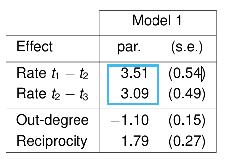
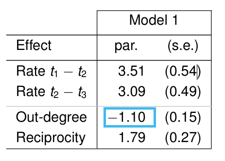
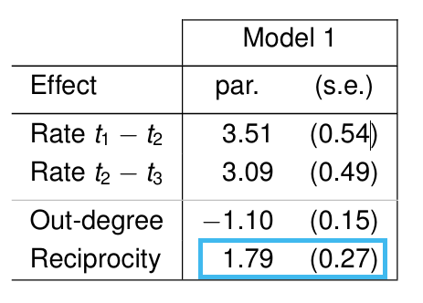
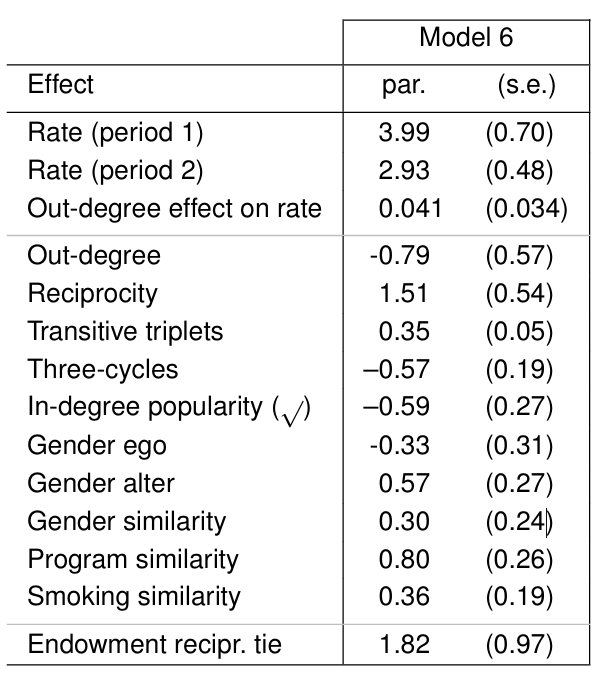
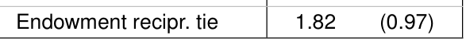

## Flows {.custom-smaller}

```{r, echo=FALSE, out.width="100%"}
knitr::include_graphics("Images/11flows1.png")
```

## Flows {.custom-smaller visibility="uncounted"}

```{r, echo=FALSE, out.width="100%"}
knitr::include_graphics("Images/11flows2.png")
```

## Flows {.custom-smaller visibility="uncounted"}

```{r, echo=FALSE, out.width="100%"}
knitr::include_graphics("Images/11flows3.png")
```

## Flows {.custom-smaller visibility="uncounted"}

```{r, echo=FALSE, out.width="100%"}
knitr::include_graphics("Images/11flows4.png")
```

## Flows {.custom-smaller visibility="uncounted"}

```{r, echo=FALSE, out.width="100%"}
knitr::include_graphics("Images/11flows5.png")
```

## Agenda: Models for Network Diffusion {.custom-smaller}

1.  Flows

2.  SIR model

3.  Network topology effects

4.  Simulation Models

5.  Dynamic Networks

6.  Social and behavioral diffusion

7.  Treshold Models

## Agenda: Models for Social Influence {.custom-smaller}

1.  Network Theory

2.  Causal Inference

3.  Methodological Challenges

4.  Research Strategies

5.  Modeling effects of Network social influence (Instrumental Variable)

6.  Stochastic Actor-Oriented Models (SAOMs)

7.  Sensitivity Analysis

## SIR model {.custom-smaller}

```{r, echo=FALSE, out.width="100%"}
knitr::include_graphics("Images/13SIR.png")
```

::: {style="font-size: 0.8em; text-align: left;"}
$\frac{dS}{dt} = - \frac{\beta SI}{N}$

$\frac{dI}{dt} = \frac{\beta SI}{N} - \gamma I$

$\frac{dR}{dt} = \gamma I$

reproductive number $R_0 = \frac{\beta}{\gamma}$
:::

## SIR model over time {.custom-smaller}

```{r, echo=FALSE, out.width="100%"}
knitr::include_graphics("Images/13timesir.png")
```

## Varying infection behavior {.custom-smaller}

::: {style="font-size: 0.8em; text-align: left;"}
$\beta = vc$,\
$v =$ transmission probability given contact, $c =$ average contact rate

$R_0 = v\bar{c}d$
:::

network diffusion process governed by:\
1. topology of the network structure\
2. the timing of relations of infection (i.e., duration and sequence)

## Network topology effects on diffusion {.custom-smaller}

**virulence**: probability that one person will pass an infection to another given contact:\
\
[$v = P_{ij}$, where $v > 0$ when $i$ is infected and $j$ is susceptible]{style="font-size:0.8em;"}

-   Connectivity\
    What drives diffusion?\

    1.  Geodesic distance\
    2.  Structural cohesion

-   Efficiency

-   Volume

## Network topology effects on diffusion {.custom-smaller}

```{r, echo=FALSE, out.width="100%"}
knitr::include_graphics("Images/141avgdeg.jpg")
```

::: {style="font-size: 0.6em; color: gray;"}
Average degree and component size.\
Source: https://networksciencebook.com/chapter/3#evolution-network
:::

## Network topology effects on diffusion {.custom-smaller}

-   Efficiency

```{r, echo=FALSE, out.width="100%"}
knitr::include_graphics("Images/142efficiency.png")
```

## Network topology effects on diffusion {.custom-smaller}

-   Volume: total amount of direct contact

```{r, echo=FALSE, out.width="100%"}
knitr::include_graphics("Images/143stdiffusion.png")
```

##  {.custom-smaller}

```{r, echo=FALSE, out.width="100%"}
knitr::include_graphics("Images/143stdiffusion.png")
```

## Simulation models: test how network structure affects diffusion {.custom-smaller}

```{r, echo=FALSE, out.width="100%"}
knitr::include_graphics("Images/143topsimulation.png")
```

## Simulation models: test how network structure affects diffusion {.custom-smaller visibility="uncounted"}

```{r, echo=FALSE, out.width="100%"}
knitr::include_graphics("Images/143topsimulation5.png")
```

## SIR diffusion model assumptions {.custom-smaller}

-   Individual Contagion

-   Stability of the contagion

-   Irrelevance of the contagion to the infector

-   Single-Source Adoption

-   Simple state change

-   Dyadic independence

## Stochastic Actor-Oriented Models (SAOMs) old {.custom-smaller}

SAOM: agent-based model in which agents attempt to maximize utility functions on network relations and behaviors

-   includes relational formation model (ERGMs)

-   includes peer influence models (formation model- and behavior model equations)

maximize utility functions on network relations and behaviors

$f_i(\beta, x) = \sum_k \beta_kS_{ki}(x) + \epsilon(x, z, t, j)$

::: fragment
$f_i^z(\beta, x) = \sum_k \beta_k^z S_{ki}^z(x, z) + \epsilon(x, z, t, v)$
:::

## Core requirements of SAOMs old {.custom-smaller}

1.  data collected at two or more points in time\
2.  small to moderately sized networks\
3.  some degree of observed change between time points (Jaccard index of $0.3$ to $0.6$)\
4.  directed networks

## Assumptions of SAOMs old {.custom-smaller}

1.  actors have agency over links and behavior\
2.  time is continuos\
3.  ties at relatively stable states\
4.  network change is outcome of Markov process\
5.  actors are omniscient and behave rational\
6.  only one tie can be changed a time

## Stochastic Actor-Oriented Models (SAOMs) {.custom-smaller}

::::: columns
::: {.column width="40%"}
```{r, echo=FALSE, out.width="100%"}
knitr::include_graphics("Images/1saomIntro1.png")
```
:::

::: {.column width="60%"}
:::
:::::

## Stochastic Actor-Oriented Models (SAOMs) {.custom-smaller visibility="uncounted"}

::::: columns
::: {.column width="40%"}
```{r, echo=FALSE, out.width="100%"}
knitr::include_graphics("Images/1saomIntro2.png")
```
:::

::: {.column width="60%"}
:::
:::::

## Stochastic Actor-Oriented Models (SAOMs) {.custom-smaller visibility="uncounted"}

::::: columns
::: {.column width="40%"}
```{r, echo=FALSE, out.width="100%"}
knitr::include_graphics("Images/1saomIntro3.png")
```
:::

::: {.column width="60%"}
:::
:::::

## Stochastic Actor-Oriented Models (SAOMs) {.custom-smaller visibility="uncounted"}

::::: columns
::: {.column width="40%"}
```{r, echo=FALSE, out.width="100%"}
knitr::include_graphics("Images/1saomIntro3.png")
```
:::

::: {.column width="60%"}
```{r, echo=FALSE, out.width="100%"}
knitr::include_graphics("Images/1saomIdee.png")
```
:::
:::::

##  {.custom-smaller}

```{r, echo=FALSE, out.width="100%"}
knitr::include_graphics("Images/2ministeps.png")
```

## Assumptions of SAOMs {.custom-smaller}

1.  X is adjacency matrix of directed graph;\
    tie indicator $(x_{ij}) = \begin{cases} 0 & \text{no tie exists} \\ 1 & \text{tie exists} \end{cases}$

2.  independent variables: Actor features $v_i$, Dyadic features $w_{ij}$

3.  continuous time parameter t, observed moments $t_1, ..., t_M$

4.  network change process follows Markov-process

5.  Actor control their outgoing ties

6.  One-Tie-at-a-Time

7.  Ties are states, not events.

8.  Actors act benefit-oriented

9.  Actors act independently, dependence between actors only by time order

## Model Components {.custom-smaller}

::: {style="font-size: 0.8em; text-align: middle;"}
$X = (x_{ij})$, $(x_{ij}) = \begin{cases} 0 & \text{no tie exists} \\ 1 & \text{tie exists} \end{cases}$

Actor features $v_i$\
Dyadic features $w_{ij}$
:::

-   Rate function: Rate of change of the network by actor $i$ is denoted $λ_i$

-   Objective function $f_i(β,x)$ indicates preferred ‘directions’ of change

## Rate Function {.custom-smaller}

Rate of change of the network by actor $i$ is denoted $λ_i$:\
expected frequency of changes by actor $i$ between observations.

rate functions can depend on:

-   observation period $(t_{m-1}, t_m)$

-   actor covariates

-   network position (degrees etc.)

through exponential link function.

non-constant rate function $\lambda_i(\alpha, x) = \rho_m \exp (\sum_h \alpha_h v_{hi})$

Probability that actor $i$ randomly gets opportunity to change a tie in time interval $(t, t + \epsilon)$ is given by $\epsilon \lambda_i$.

## Objective Function {.custom-smaller}

Conditional on actor i being allowed to make a change, probability for that $X_{ij}$ changes to $1 - X_{ij}$ follows multinomial-logit-model: $p_{ij}(\beta, x) = \frac{\exp(f_i(\beta,\ x(i \rightsquigarrow j)))}{\sum_{h = 1}^n \exp(f_i(\beta,\ x(i \rightsquigarrow h)))}$

$f_i(\beta, x) = \sum_k \beta_k s_{ik}(x)$

$s_{ik}(x)$ are evaluation functions

--\> myopic stochastic optimization

Actor $i$ chooses $\max_j\ (f_i(\beta, x(i \rightsquigarrow j))\ +\ U_i(t, x, j))$ (random utility model with $U \sim \text{Gumbel}(\mu, \beta)$)

## Evaluation Function {.custom-smaller}

Choose possible network effects for actor $i$:

|  |  |
|:------------------------|:----------------------------------------------|
| Outdegree | $s_{i1}(x) = x_{i+} = \sum_j x_{ij}$ |
| Reciprocity | $s_{i2}(x) = \sum_j x_{ij}x_{ji}$ |
| Transitivity (triplets) | $s_{i3}(x) = \sum_{j, h} x_{ij}\ x_{jh}\ x_{ih}$ |
| Balance | $s_{i4}(x) = \sum_{j = 1}^n x_{ij} \sum_{\substack{h=1\\ h\neq i,j}}^n (1\ -\ |x_{ih}\ -\ x_{jh}|)$ |
| covariate-related popularity | $s_{i5}(x) = \sum_j x_{ij}\ v_j$ |

transitivity (ties), indirect ties, in-degree related popularity, out-degree related popularity, out-degree related activity, in-degree related activity, three-cycle, covariate-related activity, covariate-related similarity, covariate-related interaction, covariate-related preference ($w_{ij}$), ...

## Interpretation {.custom-smaller}

-   32 students

-   $(t_1, t_2, t_3)$ at 6, 9, 12 weeks after start of university

-   "friendly relation"

```{r, echo=FALSE, out.width="100%"}
knitr::include_graphics("Images/model1.png")
```

## Interpretation {.custom-smaller visibility="uncounted"}

-   32 students

-   $(t_1, t_2, t_3)$ at 6, 9, 12 weeks after start of university

-   "friendly relation"

```{r, echo=FALSE, out.width="100%"}

```

## Interpretation {.custom-smaller visibility="uncounted"}

-   32 students

-   $(t_1, t_2, t_3)$ at 6, 9, 12 weeks after start of university

-   "friendly relation"

```{r, echo=FALSE, out.width="100%"}

```

## Interpretation {.custom-smaller visibility="uncounted"}

-   32 students

-   $(t_1, t_2, t_3)$ at 6, 9, 12 weeks after start of university

-   "friendly relation"

```{r, echo=FALSE, out.width="100%"}

```

## Interpretation {.custom-smaller visibility="uncounted"}

-   32 students

-   $(t_1, t_2, t_3)$ at 6, 9, 12 weeks after start of university

-   "friendly relation"

```{r, echo=FALSE, out.width="100%"}

```

Evaluation function: $f_i(x) = \sum_j (-1.10\ x_{ij} + 1.79\ x_{ij}\ x_{ji})$

Adding reciprocated tie: $-1.10 + 1.79 = 0.69$

Adding non-reciprocated tie: $-1.10$

Standard error of Gumbel distributed disturbances: $1.28$

Deciding: $P_{\text{reciprocated}} = \frac{\exp(0.69)}{\exp(0.69) + \exp(-1.10)} = 0.858$

## Interpretation {.custom-smaller visibility="uncounted"}

```{r, echo=FALSE, out.width="100%"}
knitr::include_graphics("Images/model2.png")
```

## Endowment Function {.custom-smaller}

Extended model specification: for differently working effects for creation than termination of ties.

updated relative log-probabilities: $f_i(\beta, x(i \rightsquigarrow j))\ -\ x_{ij}\ g_i(\gamma, x, j)$

endowment function $g_i(\gamma, x, j) = \sum_{h=1}^H \gamma_h\ r_{ijh}(x)$

::::: columns
::: {.column width="37%"}
```{r, echo=FALSE, out.width="100%"}

```
:::

::: {.column width="60%"}
```{r, echo=FALSE, out.width="100%"}

```
:::
:::::

## Behavior SAOM and Influence-effects {.custom-smaller}

Behavior $Z = (z_1, ..., z_2)$

2.  Objective Function: $f_i^Z(\beta, x, z(i, h \rightsquigarrow v)) = \sum_k \beta_k\ s_{ik}(x, z(i, h \rightsquigarrow v))$

```{r, echo=FALSE, out.width="100%"}
knitr::include_graphics("Images/behavior.png")
```

## Behavior SAOM and Influence-effects {.custom-smaller visibility="uncounted"}

Behavior $Z = (z_1, ..., z_2)$

2.  Objective Function: $f_i^Z(\beta, x, z(i, h \rightsquigarrow v)) = \sum_k \beta_k\ s_{ik}(x, z(i, h \rightsquigarrow v))$

::::: columns
::: {.column width="50%"}
Influence-Effekte:

-   Linear Tendency $z_i$

-   Quadratic Tendency $z_i^2$

-   Average Similarity $\frac{1}{x_{i+}}\sum_j x_{ij}\ \text{sim}(z_i, z_j)$\
    similarity between $v_i$ and $v_j$:\
    $\text{sim}(z_{ih}, z_{jh}) = 1 - \frac{|z_{ih}-z_{jh}|}{R_{Z^h}}$

:::

::: {.column width=50%"}
```{r, echo=FALSE, out.width="100%"}
knitr::include_graphics("Images/behaviorQuadratic.png")
```
:::
:::::

## Interpretation {.custom-smaller}
::::: columns
::: {.column width="50%"}
```{r, echo=FALSE, out.width="100%"}
knitr::include_graphics("Images/behaviorInterpret1.png")
```
:::

::: {.column width=15%"}
```{r, echo=FALSE, out.width="100%"}
knitr::include_graphics("Images/behaviorInterpret2.png")
```
:::
:::::

## Estimation {.custom-smaller}

Siena/RSiena

1.  Condition on $X(t_1)$

2.  Choose to $\theta$ sensitive statistic $Z = (Z_1, ..., Z_K)$:\
    $Z = (C, S_1, ..., S_{K-1})$\
    with $C = \hat{\lambda}_i(x) = \sum_{\substack{i,j=1\\ i\neq j}}^g |X_{ij}(t_2) - X_{ij}(t_1)|$ and $S_i = \sum_{i=1}^n s_{ik}(X(t_2))$

3.  Determine $\hat{\theta}$ of $\theta = (\rho, \beta)$ for which $E_{\hat{\theta}}\{Z\} = z$\
    Find $\hat{\theta}$ by Robbinson-Monro process based on repeated simulations and adjusting parameter values\

## Non-directed networks {.custom-smaller}

modeling options:

1.  Forcing model

2.  Unilateral initiative with reciprocal confirmation

3.  Pairwise conjunctive model

4.  Pairwise disjunctive (forcing) model

5.  Pairwise compensatory (additive) model

## Probleme {.custom-smaller}

## Sources {.custom-smaller}

Rawlings, C. M., Smith, J. A., Moody, J., & McFarland, D. A. (2023). *Network analysis: integrating social network theory, method, and application with R*. Cambridge University Press - Kapitel 14 und 15

chrome-[extension://efaidnbmnnnibpcajpcglclefindmkaj/https://www.stats.ox.ac.uk/\~snijders/siena/IntroSAOM_h.pdf](extension://efaidnbmnnnibpcajpcglclefindmkaj/https://www.stats.ox.ac.uk/~snijders/siena/IntroSAOM_h.pdf)

## Appendix: Computer simulation algorithm for arbitrary rate function $\lambda_i$ {.custom-smaller}

1.  Set $t = 0$ and $x = X(0)$

2.  Generate S by exponential distribution with mean $1/\lambda_+(\alpha, \rho, x) = 1 / \sum_i\lambda_i(\alpha, \rho, x)$

3.  Select $i$ using probabilities $\frac{\lambda_i(\alpha, \rho, x)}{\lambda_+(\alpha, \rho, x)}$

4.  Select $j$ using probabilities $p_{ij}(\beta, x)$

5.  Set $t = t + S$ and $x = x(i\rightsquigarrow j)$

6.  Go to step 2 (unless stopping criterion satisfied)

## Appendix: Robbins-Monro process {.custom-smaller}

method of moments implemented with Monte Carlo simulation

Iteration Step: $\hat{\theta}_{N+1} =\hat{\theta}_N - a_ND^{-1}(z_N - z)$ -\> Iterate until convergence\
with $z_N$ is simulation of Z with parameter $\hat{\theta}_N$\
$D_{\theta}$ is estimated from MC simulation: $D_{\theta} = \frac{\partial}{\partial \theta}E\{Z|X(t_1) = x(t_1)\}$

extra simulations:

1.  to check $E_{\hat{\theta}}\{Z\} \approx z$

2.  to estimate $\sum_{\theta} = \text{cov}\{Z|X(t_1) = x(t_1)\}$

3.  to estimate $D_{\theta}$ using a score function algorithm

Compute $\text{cov}(\hat{\theta}) \approx D_{\theta}^{-1}\sum_{\theta}(D_{\theta}^{-1})'$ for standard error computation

## Appendix: Interpretation of non-constant rate and endowment effects {.custom-smaller}

::::: columns
::: {.column width="40%"}
```{r, echo=FALSE, out.width="100%"}

```
:::

::: {.column width="60%" style="font-size: 0.6em;"}
Rate Function $\lambda_i = \rho_m \exp(\alpha \cdot \text{Outdegree}_i)$, $\alpha = 0.041$\
additional friendship lifts probability for activity by factor $\exp(0.041) = 1.042$, means $+4.2\%$.

If reciprocated tie is deleted: Utility-function is lowered by $-\beta_{\text{reciprocity}} - \gamma_{\text{endowment recipr. tie}} = -1.51 - 1.82 = -3.33$
:::
:::::
